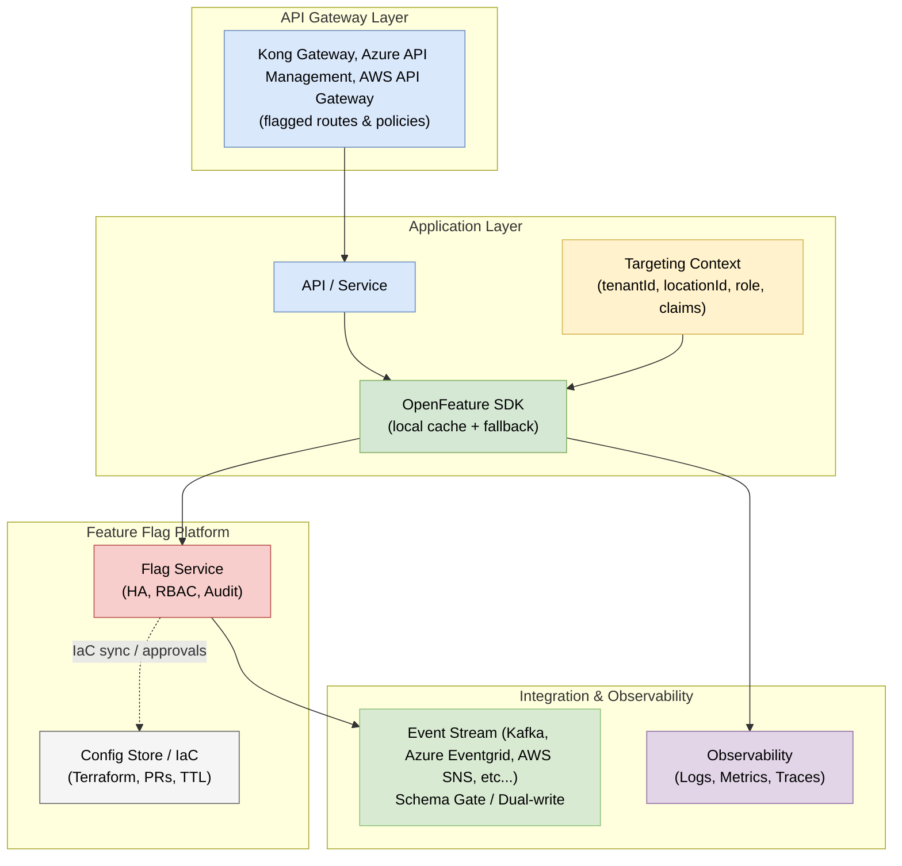
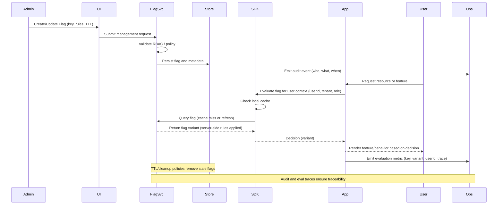

Feature flags have become one of the most powerful tools in the modern architect’s toolkit. They allow teams to control application behavior dynamically without redeploying code. Used well, they create the safety net that lets organizations move faster while reducing risk.

Before implementing feature flags, it helps to think of them not as a developer shortcut, but as an architectural capability. A good design approach treats feature flags as part of the platform, not just part of the code.

---

 

## What Feature Flags Enable

Feature flags (sometimes called toggles or switches) let you change application behavior at runtime. The simplest case is turning a feature on or off. At scale, they enable much more.

- **Progressive delivery:** Release features gradually to specific users, tenants, or environments.  
- **Kill switches:** Disable a component or integration instantly if it fails.  
- **A/B experiments:** Test new behaviors safely and measure results.  
- **Dark launches:** Deploy new code paths before exposing them.  
- **Configuration gating:** Route traffic to new APIs, schemas, or event consumers step by step.  

The key benefit is separating *deployment* from *release*. That distinction allows teams to deploy safely and control exposure independently.

---

## Thinking Like an Architect

Feature flags introduce runtime decision points into your system. As architects, we should think beyond code toggles and consider governance, placement, and observability.

### 1. Governance and Lifecycle

Flags are configuration that affects logic. Without oversight, they can accumulate quickly and create operational risk. Good governance includes:

- **Ownership and RBAC:** Who can create, modify, and retire flags.  
- **Audit trails:** What changed, when, and by whom.  
- **Expiration policies:** Time-to-live or cleanup cadences.  
- **Promotion flow:** Review and approval before production use.  

Treat flags like code: version them, review them, and remove them when they are no longer needed.

---

### 2. Targeting Model

Decide what a “target” means in your system and be consistent.  

Flags can be evaluated at several levels:
- **Environment level:** dev, test, and production isolation.  
- **Tenant level:** control features for specific clients or organizations.  
- **User level:** roll out to selected roles or cohorts using multiple criteria (location, license level, etc...).  

A clear targeting identity—derived from tokens, headers, or user claims—keeps behavior predictable and makes troubleshooting easier.

---

### 3. Integration and Placement

Where you evaluate a flag matters.

| Location | Purpose | Example |
|-----------|----------|----------|
| **API Gateway** | Routing and access control | Gradually shift traffic to a new endpoint |
| **Service Layer** | Business logic toggle | Enable new rules for specific users |
| **Event Layer** | Schema evolution and gating | Publish both v1 and v2 events |
| **UI Layer** | User experience control | Show new features to beta testers |

Each layer involves tradeoffs in latency, caching, and failure behavior. Plan for local caching, safe defaults, and graceful degradation.

---

## Reference Architecture

The following diagram illustrates a vendor-neutral architecture showing how feature flags integrate across multiple layers of a distributed system—from the API gateway through application services to observability and event streaming:

This pattern emphasizes a centralized flag service (such as LaunchDarkly, Split, Unleash, or Azure App Configuration Feature Manager), a standardized SDK like [OpenFeature](https://openfeature.dev), and observability hooks to trace flag decisions across the system.

---

### Flag Lifecycle & RBAC (Sequence)

Below is a compact sequence diagram that illustrates the end-to-end lifecycle of a feature flag and where RBAC (role-based access control) checks and observability hooks belong. It shows an administrator creating or updating a flag (via UI or API), the flag service validating permissions and persisting the configuration, and how an application evaluates the flag at runtime through an SDK (with caching and fallback). Audit and evaluation events are emitted for traceability and TTL/cleanup policies remove stale flags.

## Implementation Principles

A successful feature flag strategy requires more than just the right tools—it demands clear engineering principles that guide design, operation, and governance decisions. The following principles prioritize safety, observability, and portability. Use them as a foundation and adapt them to your organization's scale and risk profile.

| Principle | Description |
|------------|--------------|
| **Flags are configuration, not logic** | Keep application code vendor-neutral. |
| **Governed, not ad-hoc** | Treat flag changes as managed operations. |
| **Fail gracefully** | Design for safe degradation if the flag service is down. |
| **Trace everything** | Include flag key, variant, and version in telemetry. |
| **Expire aggressively** | Remove stale flags regularly. |
| **Open standards first** | Use OpenFeature for consistency and portability. |

---

## Observability and Safety

Feature flags increase flexibility but also introduce risk. Make them observable:

- Correlate flag changes to deployments and incidents.  
- Emit metrics showing flag evaluations and variants.  
- Track unused or expired flags through dashboards.  

Over time, visibility into flag behavior becomes as important as deployment telemetry.

---

## Finally

Feature flags are more than a development convenience. They are an architectural mechanism for controlling change safely and deliberately.  

When combined with good governance and observability, feature flags help teams ship continuously, recover quickly, and evolve systems with confidence.

### Practical Checklist

- Inventory flags and assign owners (create a flag catalog).  
- Apply TTL/expiration and enforce cleanup cadences.  
- Require PRs or change approvals for flag creation in production.  
- Integrate flag changes into incident playbooks (how to rollback via flags).  
- Ensure SDKs have safe defaults and local caching.

### Common Pitfalls to Avoid

- Leaving flags enabled long after the experiment — stale flags increase complexity.  
- Putting business logic only behind flags without proper tests or monitoring.  
- Over-scoping flags (too many targeting criteria) which makes evaluation and testing difficult.  
- Treating flags as a replacement for poor release processes rather than a complement.

### Monitoring & Metrics

- Flag evaluation rate (per key) and variant distribution.  
- Error/latency rate when evaluating flags (to detect SDK or service outages).  
- Audit trail volume and any denied-admin attempts.  
- Correlation between flag variants and business KPIs for experiments.

### Next Steps

- Start small: pilot with a single service and clearly defined flag lifecycle.  
- Adopt OpenFeature or a consistent SDK pattern across services.  
- Automate flag cleanup and add a daily/weekly review for stale entries.  
- Treat feature flags as part of your platform and include them in architecture reviews and runbooks.
