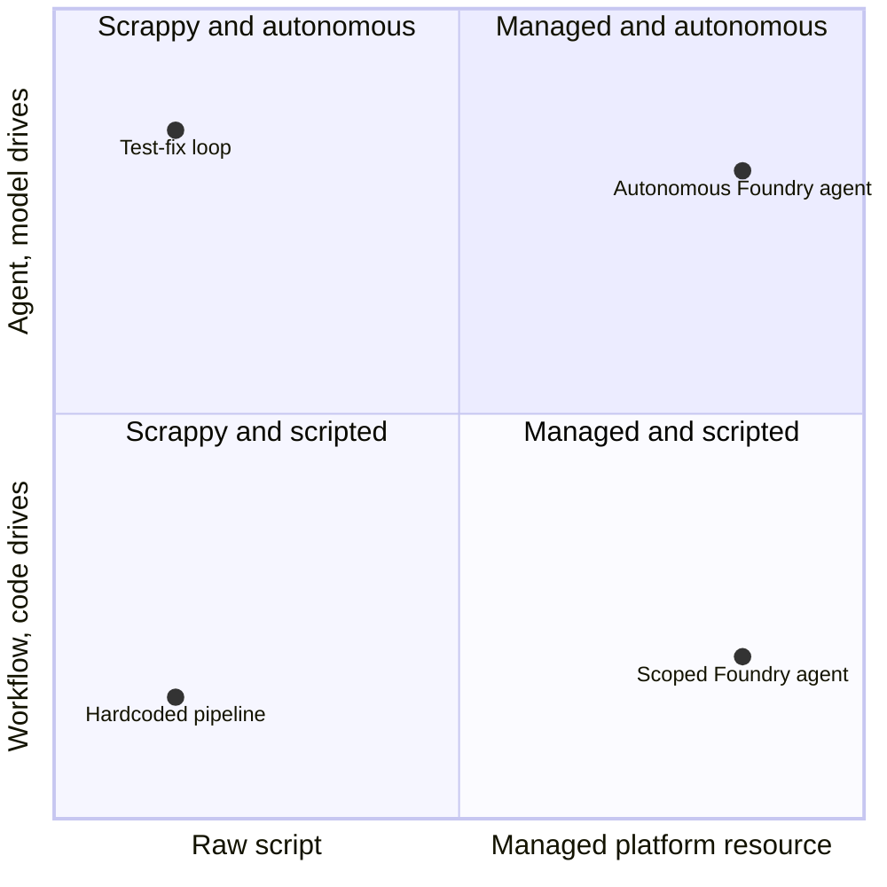

Everyone says "agent" now. Roadmaps have an agent workstream. Vendors ship an agent SKU. Every conference talk this year seems to have "agentic" in the title. But stop the conversation and ask "wait, what do you mean by agent, specifically?" and you get a pause more often than a crisp answer.

That's not because people are being sloppy. It's because "agent" is currently doing at least three different jobs, and nothing forces a speaker to say which one they mean.

## Job one: agent as a description of autonomy

The cleanest definition I know of comes from Anthropic's [Building Effective Agents](https://www.anthropic.com/engineering/building-effective-agents):

> *Workflows are systems where an LLM and tools are orchestrated through predefined code paths, while agents are systems where the LLM dynamically directs its own process and tool use, keeping control over how it accomplishes a task.*

Read that again and notice what it doesn't say. It doesn't say an agent has memory, or a name, or a UI, or a product page. It's a statement about *who's driving*. If your code decides what happens next, that's a workflow, no matter how many LLM calls are in it. If the model decides what happens next, that's an agent, even if it's a single function with a while loop around it.

Take a script that hands a model a failing test, a shell tool, and one instruction: fix it. The model reads the failure, proposes a patch, applies it, reruns the test, and decides for itself whether to try again, try something different, or stop and report success. Nobody wrote "retry up to three times" or "if the second patch fails, escalate." The model is deciding, turn by turn, what happens next. That's an agent under this definition, and it didn't need a name, a UI, or a product page to qualify. It just needed the loop's control handed to the model instead of the code.

Under this definition, "agent" is a point on a spectrum, not a category you're either in or out of. A system can be mostly workflow with one agentic step, or fully agentic end to end. That nuance is exactly what gets lost when the word gets used as a product label instead.

## Job two: agent as a product feature name

This is where it gets genuinely confusing, and GitHub Copilot is the clearest example I've got. This isn't one company's product versus another's — it's three different features from the *same* product, all called some version of "agent":

**Agent Mode** is the one you sit in front of. Select "Agent" from the chat mode dropdown in VS Code and Copilot plans a multi-step task, edits files, runs terminal commands, and iterates on the results live, while you watch and can interrupt.

**Coding agent** is the one you don't sit in front of. Assign it a GitHub issue and it works in the background, on GitHub's infrastructure, and comes back with a pull request, tests, and a self-review already done.

**Custom agents** are neither a mode nor a background worker. They're `.agent.md` files in `.github/agents/` — a name, a description, a tool allowlist, and a system prompt — that Copilot can delegate to as a subagent when it decides your specialist is the right one for the job. I wrote about the design work behind these in [Generic Agents Are a Tax](/2026-08-03-generic-vs-custom-agents/).

Three different things. Different autonomy levels, different execution environments, different mental models for the user, all sharing a name. If a teammate tells you "we should build an agent for this," you don't yet know whether they mean "let's give this task more autonomy" or "let's define a `.agent.md` file" or "let's use GitHub's background worker." Those are three different afternoons of work.

## Job three: agent as a platform primitive

The third job is the one furthest from Anthropic's autonomy-first definition. Azure AI Foundry's Agent Service describes an agent as a configuration wrapped around an underlying model — instructions, tools, knowledge sources — bundled into a managed, deployable, versionable resource. The [Foundry docs](https://learn.microsoft.com/en-us/azure/ai-foundry/agents/overview) frame the Agent Service's job as connecting models, tools, and frameworks into a single runtime that handles conversation state, tool orchestration, content safety, identity, and observability.

Notice what's *not* load-bearing in that definition: autonomy. A Foundry agent can be highly autonomous, or it can be a tightly scoped single-turn assistant that always calls the same two tools in the same order. Either way, it's "an agent," because in this sense the word means something closer to *deployment unit* — the artifact you version, configure, and stand up a runtime for. It's a noun describing packaging, not a claim about how much control the model has over its own process.

That's a different axis from Anthropic's. You can be high on the autonomy axis and low on the platform-primitive axis (a scrappy while-loop script nobody would call "an agent" in the Foundry sense) or the reverse (a Foundry-deployed agent resource that's barely more autonomous than a form-filling chatbot).



The test-fix loop from job one and the tightly scoped Foundry assistant from job three land in opposite corners: nearly all autonomy and no packaging, versus nearly all packaging and almost no autonomy. Both get called "an agent." The word doesn't distinguish between them because the two axes it's tracking aren't the same axis at all.

## Why the conflation costs you something

None of this is pedantry for its own sake. It shows up as real friction:

In architecture conversations, "should this be an agent" gets debated as if it's one decision, when it's actually three: how much control should the model have over the next step (job one), which vendor feature are we reaching for (job two), and how do we want to package and deploy this thing (job three). Answering one doesn't answer the others.

"Copilot has agents and so does Foundry" sounds like a feature-parity statement. It isn't. One vendor is describing an autonomy mode inside a developer tool; the other is describing a managed runtime for deploying model configurations. Comparing them on the word alone tells you nothing.

Same with hiring: "experience building agents" means something different depending on which job the interviewer has in mind. An engineer who's tuned how much autonomy to hand an LLM loop reads very differently from one who's mostly configured tool bundles in a managed platform, even though both would honestly list "agents" on a resume.

## The ten-second question

When "agent" comes up in a design conversation, I've started asking one question before we go further: *autonomy, feature, or primitive?* Are we talking about how much control the model has over its own process, a specific named product capability, or a deployable configuration object? It takes ten seconds and routinely reveals that two people in the room were agreeing on a word while disagreeing on the thing.

The word isn't going to get more precise on its own. Vendors have every incentive to let "agent" absorb whatever they shipped this quarter, because it's currently the best-selling noun in the industry. The precision has to come from the room, before it gets built into something.

---

*Definitions current as of August 2026 and moving fast; check the source docs before quoting specifics. Autonomy framing from Anthropic's [Building Effective Agents](https://www.anthropic.com/engineering/building-effective-agents). Platform-primitive framing from Microsoft's [Foundry Agent Service overview](https://learn.microsoft.com/en-us/azure/ai-foundry/agents/overview). Copilot feature details from [GitHub's custom agents docs](https://docs.github.com/en/copilot/concepts/agents/cloud-agent/about-custom-agents).*
